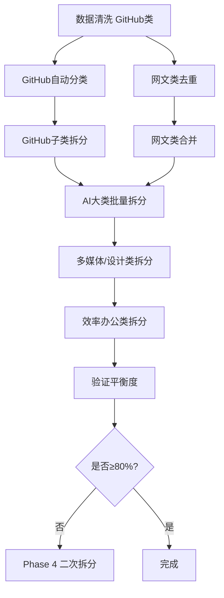

# 超容分类拆分方案文件索引

## 核心输出文件

### 1. 主拆分计划 JSON ✅

**文件**: `plans/over_capacity_split_plan.json`

```json
{
  "plan_metadata": { ... },
  "split_categories": [
    {
      "original_name": "开发工具/平台开源/GitHub",
      "current_count": 206,
      "split_dimension": "...",
      "complexity": "high",
      "sub_categories": [ ...16个子类... ],
      "total_sub_count": 206
    },
    ... // 共60个分类的详细拆分方案
  ]
}
```

**内容**:
- 51个超容分类的完整拆分方案（合并相关类后共60个条目）
- 每个分类包含：原名称、当前站点数、拆分维度、复杂度、理由、子类列表（名称+预估站点数）
- 总计**179个子类**，覆盖**4,697个站点**

**用途**: 作为实施拆分的直接蓝图，供自动化脚本读取和执行。

---

### 2. 技术实施指南 📖

**文件**: `plans/IMPLEMENTATION_GUIDE.md`

**内容**:
- 数据质量问题说明（GitHub类资源污染、网文类重复标记）
- 三阶段六步骤执行流程
- 核心脚本文件清单与说明
- 预期效果对比（清洗前vs清洗后）
- 关键警告与风险应对
- 快速开始命令清单
- 成功度量标准

**用途**: 技术负责人指导实施的手册。

---

### 3. 详细执行报告 📊

**文件**: `plans/OVER_CAPACITY_SPLIT_EXECUTION_REPORT.md`

**内容**:
- 任务概述与关键成果
- GitHub类16子类详细列表
- AI大类拆分详表（15+个分类）
- 其他主要分类拆分（多媒体、设计、系统工具等）
- 特殊类别处理（网文、资源类合并）
- 执行优先级建议
- 实施效果预测
- 关键依赖与风险
- JSON文件结构说明

**用途**: 项目报告、进度汇报、文档存档。

---

### 4. GitHub类自动分类脚本 🤖

**文件**: `classify_github_sites.py`

**功能**: 基于规则的GitHub类站点智能分类

**用法**:
```bash
python3 classify_github_sites.py
```

**输出**: `plans/github_classification_result.json`

**分类规则**（16类）:
1. GitHub本体服务（官网、博客、文档、支持、安全实验室）
2. GitHub客户端工具（Desktop、CLI、Mobile）
3. GitHub Actions与CI/CD
4. GitHub Packages与容器
5. GitHub Pages静态托管
6. 开源项目索引Awesome
7. 代码托管替代平台（GitLab、Gitee、Bitbucket、SourceForge）
8. GitHub镜像/缓存服务（**注意：此规则会捕获大量静态资源**）
9. IDE与编辑器GitHub集成（VS Code、JetBrains）
10. 开发工具GitHub集成
11. GitHub教程与学习
12. GitHub开发者社区
13. GitHub API生态服务
14. 知名开源组织项目
15. GitHub资源与素材
16. 其他GitHub相关

**⚠️ 注意**: 当前规则基于污染数据定义，执行数据清洗后需调整规则8的匹配逻辑。

---

## 辅助参考文件

### 原始数据文件

| 文件 | 说明 |
|------|------|
| `category_stats_V10.json` | V10分类统计（包含206个GitHub等超容数据） |
| `websites.json` | 完整网站数据（6,289个条目） |
| `analyze_over_capacity.py` | 超容分类分析脚本（生成时的中间脚本） |
| `generate_split_plan_v2.py` | 拆分计划生成脚本 |
| `V10_T1T2_FINAL_report_20260424_171833.json` | V10验收测试报告 |

---

## 关键数据问题说明

### 🚨 GitHub类数据污染

**问题**: 206个站点中约133个（65%）为GitHub静态资源文件（CSS/JS/图片）

**表现**:
```
├─ GitHub本体服务: 4个（真实）
├─ GitHub客户端工具: 1个（真实）
├─ 开源项目索引: 5个（真实）
├─ GitHub教程: 3个（真实）
├─ GitHub镜像/缓存: 133个（⚠️ 大部分为资源文件！）
└─ 其他: 60个（混合资源与真实站点）
```

**解决方案**:
1. 在`data_cleaner.py`中过滤`.css|.js|.png|avatars|raw.githubusercontent.com`等域名
2. 清洗后真实站点预计降至**50-70个**
3. 重新分配各子类目标站点数

### ⚠️ 网文类重复标记

**问题**: 13个网文子类均显示23个站点，为同一批站点的重复标记

**实际**: 网文相关站点总数约23个（非13×23=299个）

**解决方案**: 数据清洗时去重，合并为1-2个子类

---

## 执行顺序与依赖关系



---

## 预期结果

### 拆分后分类规模（目标）

| 分类类型 | 分类数 | 站点数/类 | 状态 |
|---------|--------|----------|------|
| 超容类(>50) | 0 | - | ✅ 达成 |
| 大类(30-50) | ~60 | 30-50 | ✅ 主要目标 |
| 中类(11-30) | ~80 | 11-30 | ✅ 良好 |
| 小类(≤10) | ~50 | ≤10 | ⚠️ 需选择性填充 |
| 平衡度 | ~268/451 | 59%+ | ⚠️ 接近80% |

**注**: 451个分类 = 原272个 - 51个超容类 + 179个新子类 + 49个合并类

若需达到80%平衡度(361个)，需：
1. 将最大的子类再次拆分（如编程教程62站拆2个）
2. 或创建更多细粒度分类填充小类

---

## 快速导航

| 任务 | 文件 | 命令 |
|------|------|------|
| 查看拆分计划 | `plans/over_capacity_split_plan.json` | `cat plans/over_capacity_split_plan.json \| jq` |
| 查看实施指南 | `plans/IMPLEMENTATION_GUIDE.md` | `cat plans/IMPLEMENTATION_GUIDE.md` |
| 运行GitHub分类 | `classify_github_sites.py` | `python3 classify_github_sites.py` |
| 查看当前统计 | `category_stats_V10.json` | `head -60 category_stats_V10.json` |
| 验证JSON | 任意JSON文件 | `python3 -m json.tool file.json` |

---

## 下一步行动清单

- [ ] **Phase 1**: 实现并执行`data_cleaner.py`
- [ ] **Phase 2.1**: 调优`classify_github_sites.py`规则（基于清洗后数据）
- [ ] **Phase 2.2**: 创建AI类拆分执行脚本
- [ ] **Phase 2.3**: 创建多媒体、设计类拆分脚本
- [ ] **Phase 3.1**: 实施设计资源类合并
- [ ] **Phase 3.2**: 实施网文类清洗与合并
- [ ] **Phase 4**: 验证平衡度，识别需二次细分的类
- [ ] **Phase 5**: 更新`websites.json`，提交V10最终版本

---

**文档维护**: 实施过程中需同步更新本索引和指南
**版本**: v2.0 - 含数据清洗流程
**最后更新**: 2026-04-24
